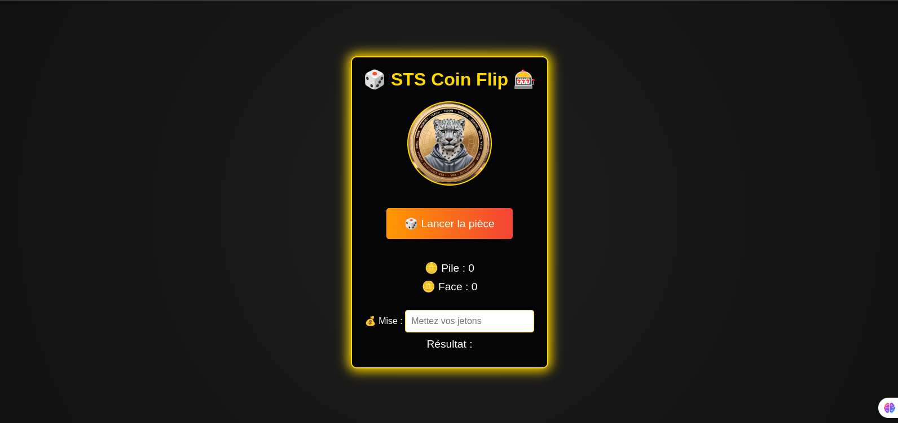

# SnowDev Tech Services Coin Flip App

Welcome to the **Coin Flip Casino Game**! This is a fun browser-based simulation of a coin flip with a touch of casino ambiance. It features animations and synchronized sound effects for an immersive experience.

## Features

- **Interactive Coin Flip:** Flip the coin with a button click and watch the realistic animation.
- **Sound Effects:** A satisfying coin flip sound plays on every flip, enhancing the user experience.
- **Live Statistics:** Tracks and displays the number of heads and tails in real-time.
- **Stylish Design:** Casino-themed visuals with a gradient background and coin textures.

## Installation

1. **Clone the Repository**:
   ```bash
   git clone https://github.com/Dimitri-Tedom/STS_CoinFlipApp.git
   ```
2. **Navigate to the Project Folder**:
   ```bash
   cd STS_CoinFlipApp
   ```
3. **Open in Browser**:
   Simply open the `index.html` file in your favorite browser.

## File Structure

```plaintext
project-directory/
├── index.html       # Main HTML file
├── assets/
│   ├── style.css    # Styling for the game
│   ├── script.js    # Logic for animations and interactions
│   ├── coin-flip.mp3 # Coin flip sound effect
│   ├── Face.jpg     # Heads side of the coin
│   └── Plie2.jpg    # Tails side of the coin
```

## Usage

1. Open the game in your browser.
2. Click the **"Flip the Coin"** button to flip the coin.
3. Observe the result (heads or tails) and listen to the synchronized sound.
4. Watch the live statistics update with every flip.

## Customization

- **Change Coin Images:** Replace `Face.jpg` and `Plie2.jpg` in the `assets` folder with your own images.
- **Update Sound Effect:** Replace `coin-flip.mp3` with a different audio file.
- **Modify Styling:** Adjust `style.css` to give the game a unique look.

## Technologies Used

- **HTML5** for structure.
- **CSS3** for styling and animations.
- **JavaScript** for interactivity and logic.

## Preview



*Screenshot of the Coin Flip Casino Game interface.*

## Contributing

Feel free to fork this repository and make your own improvements. Pull requests are welcome!

---

## **📬 Contact**

For any questions or suggestions, feel free to reach out at:  
📧 wilfried.tedom@facsciences-uy1.cm  
🔗 [GitHub Profile](https://github.com/tedom-tafotsi-dimitri-wilfried)

--- 

Enjoy flipping coins and testing your luck in this simple yet engaging game! 🎲
